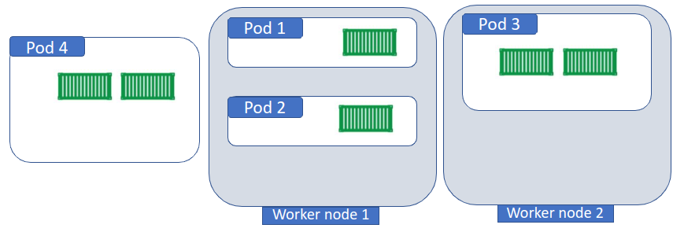

# setpod-scheduler: a kubernetes scheduler to deploy multi-pods applications 

<div align="center">
    
</div>

## Description
Coscheduling refers to the ability to schedule a group of pods at once, as opposed to the default Kubernetes behavior that schedules pods one-by-one.
This open-source scheduler, `setpod-scheduler`, aims to address critical issues encountered when deploying multi-pods applications using Kubernetes' default scheduler. The default approach of deploying pods independently can lead to resource inefficiency and increased node utilization, ultimately affecting the overall cluster's performance and resource management.


## Contributor

- Massinissa AIT ABA, massinissa.ait-aba@davidson.fr

## Table of Contents

- [Disadvantage of deploying an application pod by pod](#Disadvantage-of-deploying-an-application-pod-by-pod)
- [Setpod-scheduler](#Setpod-scheduler)
- [Deploy setpod-scheduler on a kubernetes cluster](#Deploy-setpod-scheduler-on-a-kubernetes-cluster)
- [Use setpod-scheduler to deploy K8s applications](#Use-setpod-scheduler-to-deploy-K8s-applications)
- [Example1: Illustrating Deployment of setpod-scheduler in a Kind Cluster and Application Deployment](#Example1-Illustrating-Deployment-of-setpod-scheduler-in-a-Kind-Cluster-and-Application-Deployment)
- [Accessing the setpod-scheduler Pod for Debugging](#Accessing-the-setpod-scheduler-Pod-for-Debugging)
- [Example2: Deploy the OpenAirInterface 5G Core Network on a Kubernetes cluster using setpod-scheduler and Helm](#Example2-Deploy-the-OpenAirInterface-5G-Core-Network-on-a-Kubernetes-cluster-using-setpod-scheduler-and-Helm)
- [Discussion](#Discussion)

## Disadvantage of deploying an application pod by pod

For a given application of n pods, the default scheduler deploys the application pod by pod, deciding for each pod the node on which it will be deployed independently of the other pods. When deploying a given application, some problems may arise:

- Inappropriate resource exploitation:
  Deploying pod by pod can lead to inappropriate resource exploitation. Indeed, because the scheduler makes decisions based on incomplete information, local optima are easily reached. The placement of a pod may seem optimal in terms of resource usage at a given instant, but it may turn out to be inefficient when other pods need to be scheduled in the future and may lead to the impossibility of scheduling a full application using the remaining resources. For example, assuming we want to deploy an application consisting of 4 pods to a platform of two physical nodes, each with the capacity to provide 8 cores. Pods 1 and 2 have a CPU request of 2 cores, and pods 2 and 4 have a request of 5 cores. Figure 1 shows a first deployment, pods 1 and 2 are deployed on node 1 and pod 3 on node 2.
  


<div align="center">
    
    <br>
    <em>Figure1. Deployment of 3 pods out of 4. </em>
</div>

    
  The new CPU capacities of the two nodes after deploying the first 3 pods are 4 cores for node 1 and 3 cores for node 2. The deployment of pod 4 is therefore impossible because neither of the two nodes has the 5-core capacity required by pod 4. A better assignment of pods to nodes would be the deployment shown in Figure 2. The remaining CPU available on the two nodes after deploying the application is 1 core for node 1 and 1 core for node 2. 

  This example shows that the default scheduler focuses only on the pod level. However, such a method, no matter what strategy is used, can lead to sub-optimal solutions from the perspective of an application deployment. In other words, a feasible application deployment might need to consider the deployment of all the pods within an application holistically.


<div align="center">
    
    <br>
    <em>Figure2. Deployment of 4 pods out of 4. </em>
</div>


- More nodes than necessary are used:
  Deploying pod by pod may lead to the utilization of more nodes than necessary, because the choice of deploying some pods can saturate the resources of some nodes in a way that the rest of the pods of the application will need other nodes for their deployments, thus increasing the overall cost of operating the cluster. In the example shown in Figure 1, pod 4 would need a 3rd node for its deployment, while it would have been possible to deploy all the pods on 2 nodes (Figure 2).

- Deployment of unnecessary pods:
    An application is deployed if all its pods are deployed. However, by deploying the application pod by pod, it is possible that after the deployment of the first pods, the available resources will not be sufficient for the deployment of the remaining pods, the application is then refused. However, some pods have already been deployed and thus have to be deleted as they are not needed by any valid application. This implies a waste of time and unnecessary energy consumption related to the deployed pods.

## setpod-scheduler

K8s uses a scheduling framework that allows different scheduling algorithms to be implemented and used with the Kube-scheduler component. 
To avoid the above-mentioned problems, we have proposed a new scheduler. Unlike the default scheduler, setpod-scheduler first checks whether it is possible to find a feasible assignment of the pods to the cluster nodes respecting resources and labels constraints. Only if such an assignment is found, the scheduler starts the deployment of the pods composing the application sequentially following a given order. Otherwise, it rejects the application and no pod is deployed.

## Deploy setpod-scheduler on a kubernetes cluster
To deploy setpod-scheduler, run the following command:
```bash[language=bash]
kubectl apply -f setpod-scheduler.yaml
```
## Use setpod-scheduler to deploy K8s applications 
To use setpod-scheduler, specific parameters need to be added within the context of each pod in the application. To utilize the setpod-scheduler for your application's pods, ensure to include the following configuration within the `spec` section of each pod:

```yaml
spec:
  schedulerName: setpod-scheduler
```

Furthermore, make sure to include the following configurations within the pod's metadata section:

```yaml
metadata:
  labels:
    id: "1"
    app_ad: "1" 
    nb_pods: "2" 
    timelimit: "10"
  spec:
    schedulerName: setpod-scheduler
```

Here's an explanation of each label:

- 'id': This label signifies an identifier that uniquely distinguishes the pod within the context of its application. It helps differentiate between multiple pods belonging to the same application. Additionally, in the context of deployment sequencing, this identifier serves to establish the sequential order of pods. Pods will be deployed in numerical order according to their assigned IDs.

- 'app_ad': The 'app_ad' label serves as an application differentiator, allowing for the identification and grouping of pods belonging to different applications. It aids in categorizing pods based on their application affiliation.

- 'nb_pods': This label denotes the total number of pods associated with the specific application. It provides information about the quantity of pods that are part of the same application context.

- 'timelimit': The 'timelimit' label, when uncommented, signifies the maximum allowed time for the scheduling algorithm to find a suitable deployment or assignment solution for all the pods of the application. Adjust this value based on the allotted time for the scheduling algorithm to make better pod assignments.

## Example1: Illustrating Deployment of setpod-scheduler in a Kind Cluster and Application Deployment

In this example, we'll demonstrate the process of:

- Creating a Kind cluster configuration with a specific node setup.
- Deploying the setpod-scheduler into the newly created Kind cluster.
- Deploying an application consisting of two pods within this cluster, utilizing the setpod-scheduler for pod management.

1. If you already have a cluster, you can skip this step. Begin by setting up a YAML configuration file (`cluster-config.yaml`) for the Kind cluster, specifying the required node roles.

```yaml
kind: Cluster
apiVersion: kind.x-k8s.io/v1alpha4
nodes:
- role: control-plane
- role: worker
```
To create a Kind cluster consisting of one control-plane and one worker node, use the following command:
```bash[language=bash]
kind create cluster --config kind-config.yaml
```


2. Deploy the setpod-scheduler within the newly established Kind cluster to enable its utilization for pod scheduling and management.
```bash[language=bash]
kubectl apply -f setpod-scheduler.yaml
```


3. Deploy the 'twocontainerspod-example' application by deploying the two pods 'testPod1.yaml' and 'testPod2.yaml' located in the 'example1' folder using the following two commands:

```bash[language=bash]
kubectl apply -f testPod1.yaml
```

<div align="center">
    
</div>

Then:

```bash[language=bash]
kubectl apply -f testPod2.yaml
```

<div align="center">
    
</div>

## Accessing the setpod-scheduler Pod for Debugging

If you need to troubleshoot the setpod-scheduler pod in your Kubernetes cluster, you can access it using the following command:

```bash
kubectl exec -it $(kubectl get pods --all-namespaces | awk '/setpod-scheduler/{print $2}') -n kube-system -- /bin/bash
```
Once inside the pod, you can view the logs by running:

```bash
cat std.log
```
This will display the logs of the setpod-scheduler pod
## Example2: Deploy the OpenAirInterface 5G Core Network on a Kubernetes cluster using setpod-scheduler and Helm

In this example, we deploy the OpenAirInterface (OAI) core network. We use Open Air Interface (OAI) code (v1.5.1) which creates an open source and cloud-native platform that implements the 5G Release 16 Core Network virtual functions as pods on the top of a K8s cluster. A total of 8 pods ensure the operations of the OAI Core Network (MySQL, NRF, UDR, UDM, AUSF, AMF, SMF, SPGW-U). More details can be found at this link: [OpenAirInterface 5G Core Network Project](https://openairinterface.org/oai-5g-core-network-project/).

The scheduling parameters are available in the "values.yaml" file of each pod. For example, the scheduling parameters for the AUSF pod in the file "/example2/oai-ausf/values.yaml" are:

<div align="center">
    
</div>

1. Install the Helm CLI using this link: [Helm CLI Installation](https://helm.sh/docs/intro/install/).

   Helm CLI (Command-Line Interface) is a command-line tool used for managing applications on Kubernetes clusters. It is part of the Helm package manager, which helps you package, deploy, and manage applications as reusable units called Helm charts.

   Helm provides a straightforward way to define, install, and upgrade complex Kubernetes applications. With Helm, you can define the desired state of your application using a declarative YAML-based configuration file called a Helm chart. A Helm chart contains all the necessary Kubernetes manifests, configurations, and dependencies required to deploy and run your application.

2. Install Helm Spray using this command: 
   ```bash
   helm plugin install https://github.com/ThalesGroup/helm-spray
   ```
Helm Spray is a Helm plugin that simplifies the deployment of Kubernetes applications using Helm charts. Helm is a package manager for Kubernetes that allows you to define, install, and manage applications as reusable units called charts. Helm Spray extends Helm's functionality by providing additional features and capabilities for managing the lifecycle of complex deployments. The command helm plugin install installs the Helm Spray plugin, enabling you to use its functionalities alongside Helm.

3.  Create a namespace where the helm-charts will be deployed. In this example, we deploy them in the "oai" namespace. To create the "oai" namespace, use the following command on your cluster: 
    ```bash[language=bash]
    kubectl create ns oai
    ```

6. Open a terminal and run the following commands to deploy the OAI core:
```bash[language=bash]
helm dependency update example2/oai-5g-basic
helm spray --timeout 300 --namespace oai example2/oai-5g-basic
```
The two commands are related to the Helm package manager and are used to manage and deploy Helm charts onto a Kubernetes cluster. After this, you can run this command to check the deployment of the pods:

```bash[language=bash]
watch kubectl get pods -n oai
```
The pods are deployed one by one in the order defined in the parameters following the "id".

<div align="center">
    
</div>

setpod-scheduler either deploys all the pods or deploys none if the available resources are not sufficient. After a few seconds, if the pods are deployed, you get this:

<div align="center">
    
</div>


## Discussion 
setpod-scheduler is not part of the default Kubernetes installation. However, it can be configured and activated separately. Using setpod-schedule requires modification of the manifest of each pod in the application. it can be used to deploy different types of worklods (Deployment, StatefulSet, ...).  In
addition, since setpod-scheduler works independently of the default Kubernetes scheduler,
it is important to ensure that the use of setpod-scheduler has no impact on other types of workloads that
do not use it. If you're interested in exploring the source code further or have any questions, please feel free to contact me directly.
